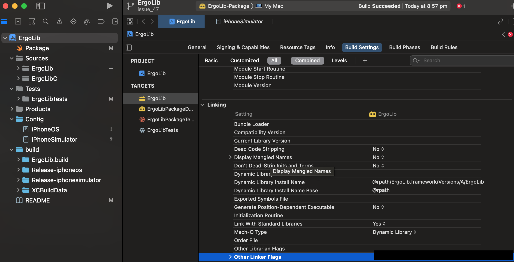

# Swift wrapper for [C bindings](../ergo-lib-c) of ergo-lib.


## Build instructions

First build `ergo-lib-c`:
```shell
cargo build --release --features rest --features mnemonic_gen -p ergo-lib-c
```
adding:
- `--target x86_64-apple-ios` for iPhone simulator on Intel macs,
- `--target aarch64-apple-ios` for iPhone on Apple silicon macs,
- `--target aarch64-apple-ios-sim` for iPhone simulator on Apple silicon macs.

To install a target run `rustup target add <target>` using triple for target from the list above.

This creates a static library under `<project_root_directory>/target/release`. Next we use `cbindgen`
to generate C-headers.
**Important:** we need a nightly version of `rustc` for this step, as we use macros to generate
*portions of the C-bindings. `cbindgen` can't 'see' through the macros so the nightly compiler is
used to expand the macros before `cbindgen` passes over the code.

```shell
cd bindings/ergo-lib-c
rustup override set nightly
cbindgen --config cbindgen.toml --crate ergo-lib-c --output h/ergo_lib.h
rustup override set stable
```


To build this project we need to point `swift` to this directory for linking.
```shell
cd ../ergo-lib-ios
swift build -Xlinker -L../../target/release/
```

To run tests we must also pass in the library directory:
```shell
swift test -Xlinker -L../../target/release/ --skip RestNodeApiTests --skip RestNodeApiIntegrationTests
```
The `RestNodeApiTests` assume you have an ergo node running on localhost.
 

### Building Xcode 13 project for `iPhoneSimulator` 

Make sure `ergo-lib-c` is built as described above.

Starting at the root of the `sigma-rust` repository, type:

```shell
cd bindings/ergo-lib-ios
swift package generate-xcodeproj
xcodebuild -project ./ErgoLib.xcodeproj -xcconfig ./Config/iPhoneSimulator_{arm|intel}.xcconfig -sdk iphonesimulator
```

choosing either `arm` or `intel` in the last line depending on your mac's architecture.

Then double click `ErgoLib.xcodeproj` which opens Xcode. You need to manually point the linker towards the directory where the `ergo-lib` static library resides. Refer to the following image: 



Set `Other Linker Flags` to be `-L/absolute/path/to/sigma-rust/target/release` for x86_64 and ` -L/absolute/path/to/sigma-rust/target/aarch64-apple-ios-sim/release` for simulator on Apple silicon macs. The project can now be built.

### Building Xcode 13 project for `iPhone(iOS)`

First we need to build an ARM64 target for `ergo-lib-c`: 

```shell
rustup target add aarch64-apple-ios
cargo build --release --target=aarch64-apple-ios -p ergo-lib-c
```

Next starting at the root of the `sigma-rust` repository, type:

```shell
cd bindings/ergo-lib-ios
swift package generate-xcodeproj
xcodebuild -project ./ErgoLib.xcodeproj -xcconfig ./Config/iPhoneOS.xcconfig -sdk iphoneos
```

Next navigate in Xcode to `Build Settings` as indicated by 1 and 2 in the picture below. Set the fields `Base SDK`, `Excluded Architecture` and `Supported Platforms` **exactly** as pictured by 3 and 4.


Then set `Other Linker Flags` to be `-L/absolute/path/to/sigma-rust/aarch64-apple-ios/release`. Finally we can build the project.